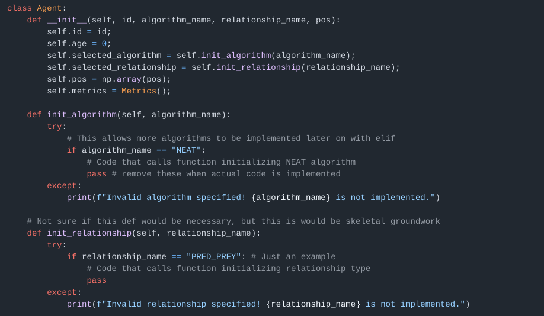

# Adrian's Engineering Notebook
### Date: October 1st, 2024
Today marks the start of the 2nd sprint. The team met in person today and our Scrum Master assisted in getting tasks assigned to each member. I started work on designing a basic agent class in Python, and started researching methods of implementing inter-process communication that would best suit our project.

### Date: October 3rd, 2024
The team met today and touched base. I continued progress on designing the basic agent class, especially since it was made easier by having a UML diagram provided by Jackson B.. With the "structure" of a basic agent better specified, I was able to implement some basic definitions into the Python file.

### Date: October 4th, 2024
Today was a big day for progress on my end. I was able to finish programming a very basic agent class, modularized for future additions as the project matures. I then successfully pushed this code onto a separate feature branch called "feature-agent". A snippet of the code is provided below:

### Date: October 15th, 2024
After an unplanned period of school absence caused by Hurricane Milton, everyone fell behind in their tasks—understandably—and our Sprint 2 progress suffered as a result. Today, the 15th, marks the first time the team met in person since before the hurricane, and we quickly touched base with everyone and quickly updated each other on how progress has been affected on each person’s end.

To start off Sprint 3, I spent the majority of progress today on assisting in completing our first update presentation initially slated for the end of Sprint 2. This included providing the burndown charts for sprints 1 and 2, and describing what went well and what didn't as a way of identifying how to improve future sprints.

### Date: October 22nd, 2024
After effectively another week-long intermission due to Fall break, the team met in person once again on today the 22nd. We updated each other on progress, and re-established what portions of the System Requirements Specification document each teammate would be working on. I promptly started work on Sections 1.1, 1.2, and 1.3, writing basic notes to then expand on.

### Date: October 23rd, 2024
Today, I completed my assigned portion of the System Requirements Specification document. For the most part, this was able to be done independently from the rest of the group. Section 1.3 did require some progress from others though, since it pertains to the general formatting of the document itself (why words may be bolded, highlighted, and so forth).

### Date: October 24th, 2024
The team met in person in our new meeting room. Much of the work spent today was on completing the System Requirements Specification document in order to mark the related sprint tasks as complete. The idea is then to revise each section to make sure that it’s of submission-quality come its due date a few days from now.