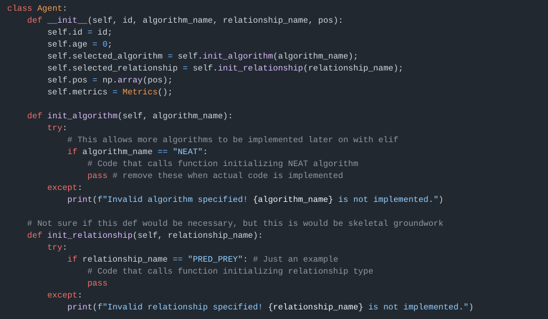
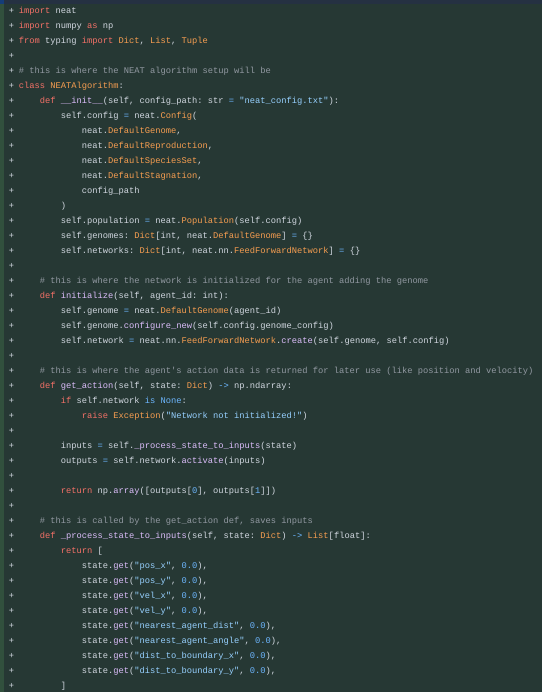
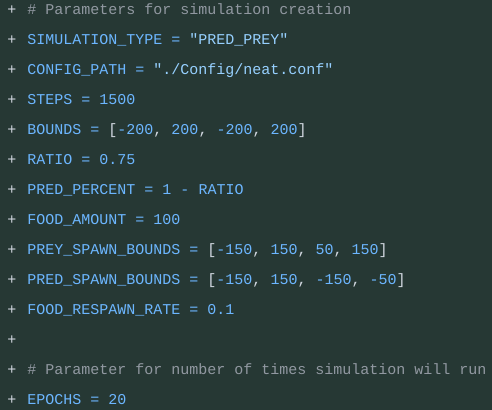
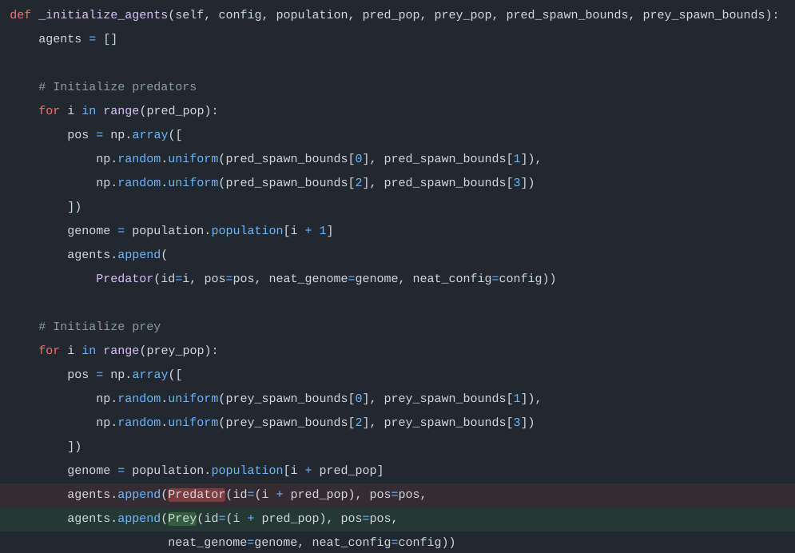

# Adrian's Engineering Notebook
### Date: October 1st, 2024
Today marks the start of the 2nd sprint. The team met in person today and our Scrum Master assisted in getting tasks assigned to each member. I started work on designing a basic agent class in Python, and started researching methods of implementing inter-process communication that would best suit our project.

### Date: October 3rd, 2024
The team met today and touched base. I continued progress on designing the basic agent class, especially since it was made easier by having a UML diagram provided by Jackson B.. With the "structure" of a basic agent better specified, I was able to implement some basic definitions into the Python file.

### Date: October 4th, 2024
Today was a big day for progress on my end. I was able to finish programming a very basic agent class, modularized for future additions as the project matures. I then successfully pushed this code onto a separate feature branch called "feature-agent". A snippet of the code is provided below:

### Date: October 15th, 2024
After an unplanned period of school absence caused by Hurricane Milton, everyone fell behind in their tasks—understandably—and our Sprint 2 progress suffered as a result. Today, the 15th, marks the first time the team met in person since before the hurricane, and we quickly touched base with everyone and quickly updated each other on how progress has been affected on each person’s end.

To start off Sprint 3, I spent the majority of progress today on assisting in completing our first update presentation initially slated for the end of Sprint 2. This included providing the burndown charts for sprints 1 and 2, and describing what went well and what didn't as a way of identifying how to improve future sprints.

### Date: October 22nd, 2024
After effectively another week-long intermission due to Fall break, the team met in person once again on today the 22nd. We updated each other on progress, and re-established what portions of the System Requirements Specification document each teammate would be working on. I promptly started work on Sections 1.1, 1.2, and 1.3, writing basic notes to then expand on.

### Date: October 23rd, 2024
Today, I completed my assigned portion of the System Requirements Specification document. For the most part, this was able to be done independently from the rest of the group. Section 1.3 did require some progress from others though, since it pertains to the general formatting of the document itself (why words may be bolded, highlighted, and so forth).

### Date: October 24th, 2024
The team met in person in our new meeting room. Much of the work spent today was on completing the System Requirements Specification document in order to mark the related sprint tasks as complete. The idea is then to revise each section to make sure that it’s of submission-quality come its due date a few days from now.

### Date: October 29th, 2024
The team met in person today, with the goal of completing our first version of the SRS document. I had tried to format it as well as I could prior to today, since transferring the original document's contents to a Confluence document proved a little problematic-- Confluence has less formatting options than what the document was originally written in (presumably Word).

### Date: November 5th, 2024
The team met today with the goal of completing our presentation slides for our second progress presentation. I created the slideshow presentation, setting up the basic slides to cover.

### Date: November 6th, 2024
We completed our progress presentation slideshow online today, in order to submit it ahead of time for the due date tomorrow.

### Date: November 7th, 2024
The team met in the instructional center today, since the first set of group presentations started today.

### Date: November 12th, 2024
Our group presented our progress update presentation today, since there wasn't enough time to do so in the first batch of presentations last class. I also completed our second peer evaluation of the semester, which was due today.

### Date: November 15th, 2024
I began trying to implement the NEAT algorithm. The bulk of progress today was in reading the documentation for the NEAT Python package, since I had no prior knowledge.

### Date: November 18th, 2024
I tried to start designing our project poster today. Using Krita, I managed to create an empty document with the proper sizes (48 inches by 36 inches), and made sure to set the color scheme to CMYK and resolution to 300ppi (the recommended resolution for documents to be printed).

It proved to be a bit problematic, however, since Krita bloated the size of the file tremendously even just adding a simple text layer to it, becoming a few gigabytes large. Thus, I wasn't able to complete it, and waited to reconvene with the team.

### Date: November 19th, 2024
The team met in person today. I finished coding a very basic implementation of NEAT within my feature-agent branch. Although not functional at this point, it's enough that it can provide a starting point for additional development, ultimately culminating in a fully functional NEAT algorithm. Once that's complete, we'll be able to connect it to the simulation, and the agents should finally be powered by a neural network algorithm.

I also briefly mentioned my troubles with poster development, which is when Canva was brought up as an alternative. We quickly transitioned to that before leaving, creating an empty template before class was over.

### Date: November 21st, 2024
The team met in person today again for this week, with the goal of completing our poster. I helped provide the text to cover our different sections of the poster, and also contributed to some of the design aspects, such as how the section divisions and boxes were colored.

### Date: November 26th, 2024
The team met in person today, and primarily worked on the SRS v2 document. I added various requirements to sections where they were either sparse or outright missing from the first version of the document.

### Date: December 3rd, 2024
The team met in person for the first time after Thanksgiving break. We spent most, if not the entire meeting time, on finalizing the final presentation to round out this semester. I helped create the formatting for the presentation, making it look better than our last two iterations. We also saw the printed version of the poster in person, and confirmed that the board we acquired was sufficiently large for it.

### Date: December 4th, 2024
The team met virtually over Discord, with the intent of completing our video presentation. After looking over the contents of the presentation once more to make sure we touched on the most important topics, we spent an hour getting both getting programs ready to record ourselves, and then doing the takes proper. Jackson S. was the one who had recording designated to, and was able to do so while streaming the presentation to our Discord voice call session.

### Date: December 5th, 2024
The team met in person today at the poster presentation session. We stayed in the Lehman building atrium for the duration of the event; I spoke with a few group members of other projects, as well to others about our own project. I also helped with the completion of the test plan document, which was due tonight.

### Date: January 21st, 2025
The team met today in person. I have been having dependency issues and thus have been unable to run the project in order to ensure changes that I make to the project codebase work properly. Unfortunately, this has hampered my productivity, so I've been focused on getting these issues fixed as soon as possible. Besides that, the team has been making good progress on HyperNEAT implementation.

### Date: January 23rd, 2025
The team met today during class time. I finally fixed my dependency issues, although the manner I did so was unconventional. Because of this, I recommended--and subsequently took it upon myself--to clean the project file structure. When the extra branches we had on GitHub were cleaned up, the merges must have resulted in some wonky directory, such as there being a "simulation" folder nested within a parent "Simulation" folder for no real reason.

Since I was reworking the file structuring, I also adjusted the dependency installation process, mainly Poetry for the Python packages.

### Date: January 24th, 2025
I finalized the project file structure rework, and pushed the changes to the feature branch focused on the implementation of HyperNEAT.

### Date: January 28th, 2025
The team met in person today, with a major breakthrough: basic NEAT configuration was finally implemented into the program. There are still major issues to adjust, since as it stands, both predator and prey populations populate instantaneously at the start. Since the environment boundaries are static, with a large enough population size, this results in a mass casualty event within the first few ticks thanks to there being no free space for prey to not be covered by predators. I updated the .gitignore file for our project to accomodate for new logging implementations.

### Date: January 30th, 2025
The team met in person today. We were able to finally see the agents working autonomously in a basic simulation, where the statistics were recorded that showed the average fitness values of both predator and prey populations fluctuating over time. We touched on steps to complete the SRS document, as it is due at the start of this next week.

Since our main Python file used for creating and running the simulation was starting to become overly large, I worked on reformatting the file to cut down on this issue. This mainly consisted of creating a new, dedicated Python file for logging purposes (besides the basic sim.log).

### Date: February 4th, 2025
The team met in person today. Since the final revision of the SRS document is due tonight, much of the discussion we had was focused on making sure we finished our new section of the document to do with global impacts. I helped complete parts of the group-assigned topics in order to get the ball rolling, then revised many of the requirements, new and old, in order to make sure that they were written in a proper manner.

### Date: February 6th, 2025
The team met in person today. Being the first meeting post-SRS submission, we touched back on base to get a feel of how everyone's been progressing in their respective tasks.

### Date: February 11th, 2025
The team met in person today. Working on code maintenance, I figured a good place to start would be to identify which files are being unused. Two files that I chose to delete were move_test.py and movement.py. These were the original pieces of movement code created last semester, which we've ended up expanding on and implementing in a better manner in other files, such as environment.py. move_test.py was also test code, and not meant to be a final product, so removing them from the project was for the best. I also made some formatting adjustments in environment.py while seeing where the movement code was implemented, in order to improve code readability. In doing so, I also noticed some pieces of code that I figure can be reworked later.

### Date: February 13th, 2025
The team met in person today. I continued working on code maintenance. Progress today involved the mutation functionality for the agents, which occurs after each epoch. The function mutate() is found in environment.py, and included a nested function breed_and_mutate(). In order to cut down on the length of the file, I opted to move the nested function into its own proper utilities file, named evolution_utils.py. I then adjusted the code of said function to be less redundant, by moving the initial if-else statement into the for loop. It is functionally the same, but cuts back on repeated code.

I also noticed that there were a few variables being used for creating the simulation that were effectively being treated as constants. In order to keep track of these constants, I created a Python module specifically for holding every constant (constants.py), which can then be imported into files where necessary.

### Date: February 19th, 2025
Today marked a turning point in my progress towards creating a better, more maintainable project codebase. Ever since we added predator and prey agent creation functionality, the code for that was delegated to a file, predator_prey.py. Two classes, Predator() and Prey(), are subclasses based on the Agent() class found in agents.py. In order to cut down on "file spam," I worked on moving these subclasses to agents.py. That way, it would also be easier to know where to look for these subclasses; it makes sense that you would find subclasses under their parent classes (though I should note that obviously this is on).

I also reworked how obstacles are created in the simulation environment. Previously, obstacles would be created with the Obstacle() class, which would include an attribute indicating the type of obstacle being created. Different types of obstacles were thus created and differentiated just by strings, such as "food." I decided to rework this into new subclasses, like Food(), which allow for the subclass to be called with various attributes automatically filled (only needing to pass a position value), rather than having to manually do so in the code every time someone wants to add a section that pertains to food spawning.

### Date: February 20th, 2025
The team met in person today, where I was able to discuss the big changes I've made to the codebase with respect to how obstacles are created in the simulation environment and where different subclasses are stored. Jackson S. and I both went over my changes, so he would be able to understand what exactly has changed and where functions may have been moved to. During this, we were able to fix a bug that popped up while I was reworking the code, where no prey agents would actually be created during the first epoch ran. As it turns out, this was due to the _initialize_agents() function never utilizing the Prey() class; I had accidentally written Predator() twice when moving this functionality to environment.py.

Besides that, after looking over the changes, I got approval from my team to merge the changes I've made into the main "feature-hyperneat" branch, so everyone can work from the new, reworked code.