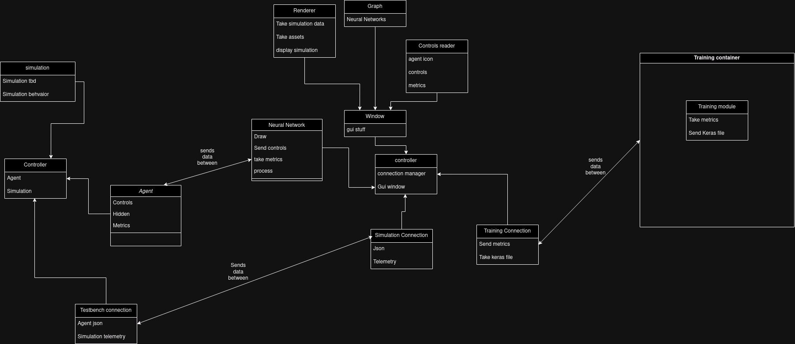

#+title: Jackson B
Engineering journal

* 10/3/2024
Today I worked on the UML diagram for the project. Dividing the project into three separate programs: a simulation, a program to run and oversee the simulations, and a training program to train the neural networks and use neuroevolution in a remote space with more power than a regular computer.

* 10/17/2024
Today I worked on creating the objects to render a neural network within the code and be compatible with the keras parser Kai is working on and the gui that Salyards is working on.
#+begin_src rust
pub struct NeuralNet {
    id: u32,
    layers: Vec<Layer>,
}
impl NeuralNet {
    pub fn new(id: u32, layers: Vec<Layer>) -> Self {
        Self { id, layers }
    }
}
pub struct Layer {
    nodes: Vec<Node>,
}
impl Layer {
    pub fn new(nodes: Vec<Node>) -> Self {
        Self { nodes }
    }
}pub struct Node {
    value: f64,
    weights: Option<Vec<f64>>,
    coordinates: Point,
}

impl Node {
    fn new(weights: Vec<f64>) -> Self {
        Self {
            coordinates: Point::new(0.0, 0.0),
            value: 0.0,
            weights: Some(weights),
        }
    }
}
impl NullConstructor for Node {
    fn new() -> Self {
        Self {
            coordinates: Point::new(0.0, 0.0),
            value: 0.0,
            weights: None,
        }
    }
}

trait NullConstructor {
    fn new() -> Self;
}
#+end_src

* 10/23/2024
Today I continued working on the neural net renderer to draw nodes and layers.
#+begin_src rust
fn draw(&self, x: f32, y: f32, renderer: &Renderer, radius: f32) -> canvas::Geometry {
    let mut frame = canvas::Frame::new(renderer, Size::new(radius * 2.0, radius * 2.0));
    let circle = canvas::Path::circle(Point::new(x, y), radius);
    frame.fill(&circle, color!(5));
    frame.into_geometry()
}
fn draw(
        &self,
        x: f32,
        height: f32,
        renderer: &Renderer,
        nodeSize: f32,
        padding: f32,
    ) -> Vec<canvas::Geometry> {

    let mut y = height;
    let mut layerGeometry = Vec::new();

    let layer_height = ((self.nodes.len() as f32) * nodeSize * 2.0)
            + (((self.nodes.len() - 1) as f32) * padding);
    let space_remaining = height - layer_height;
    let mut offset = layer_height + space_remaining / 2.0;

    for node in &self.nodes {
        layerGeometry.push(node.draw(x, offset, renderer, nodeSize));
        offset = offset - (nodeSize * 2.0 + padding); //node size is radius and circle drawer sets x and y on center so need to be nodeSize*2
    }
    layerGeometry
}
fn draw(&self, width: f32, height: f32, renderer: &Renderer) -> Vec<canvas::Geometry> {
        let mut NeuralNetGeometry = Vec::new();

        let percentPad = 0.05;
        let tallestLayer = self.layers.iter().map(|f| f.nodes.len()).max();

        let mut layerCount = 0;
        if let Some(layerSize) = tallestLayer {
            layerCount = layerSize;
        }
        let node_radius = &self.get_Node_radius(height, layerCount as f32, percentPad);
        let horizontal_positions = &self.get_Layer_positions(width, 10.0);

        for i in 0..self.layers.len() {
            let currentlayer = self.layers.get(i).expect("No Layer found");
            let current_x_pos = horizontal_positions.get(i).expect("No position found");

            let LayerGeometery = currentlayer.draw(
                ,*current_x_pos,
                height,
                renderer,
                ,*node_radius,
                node_radius * percentPad,
            );
            NeuralNetGeometry.extend(LayerGeometery);
        }

        NeuralNetGeometry
}

fn get_Node_radius(&self, size: f32, sections: f32, percentPad: f32) -> f32 {
    let node_Size: f32 = (size / sections) * (1.0 - percentPad);
    node_Size
}

fn get_Layer_positions(&self, width: f32, padding: f32) -> Vec<f32> {
    let distance = (width - (2.0 * padding)) / (self.layers.len() as f32);
    let mut x_positions = Vec::new();
    let mut x_position = padding;
    for _i in 0..self.layers.len() {
        x_positions.push(x_position);
        x_position = x_position + distance;
    }
    x_positions
}
#+end_src
* 10/24/2024
Today I made Fixes to the rust gui to fix a compilation error
can be seen in code above

* 10/29/2024
Today I added several features adding some bounds for properly drawing the Neural net.
* 10/30/2024
Today I added weight drawing to the neural net view and a JSON format for the Neural networks so that neural networks can be sent to the controller and render based on the format.
* 10/31/2024
Today I finished the weights drawing including intensisty based on the value of the weight of the weights of the neural network
* 11/1/2024
Today I merged a branch to change the looks of the GUI for the controller.
* 11/5/2024
Today I started the simulation code by initializing the poetry repository build system to run the simulation in the python virtual environment
* 11/9/2024
Today I helped with the work on the simulation and some documentation to keep our SDD in order
* 11/14/2024
Today I helped with salyards to fix the simulation environment from its memory leak issues
* 11/19/2024
On this day I helped fix an issue with the simulation taking too long
* 11/22/2024
TOday I was meeting with the rest of the team to discuss how to finalize our communications between all of our modules with our existing code
* 12/03/2024
On this day we made the decision to merge all of our backend code into dev finalizing what we have for our base modules.
* 12/05/2024
The team met for a poster session and last night we recorded our 10 minute video.
* 1/16/2025
Made Agent brain class for NEAT training
* 1/18/2025
Talked with the team on how to make the AI and how to work on the simulations
* 1/23/2025
worked on the simulation configuration system
* 1/28/2025
worked on fixing some problems to make sure the simulation works across platforms
* 1/30/2025
worked with team to clean project directories
* 2/4/2025
merged some pull requests to place features into dev and how the food system works
* 2/9/2025
started API for the two systems to talk to eachother
* 2/13/2024
Worked more towards the web connection and implementing both the rust and python versions
* 2/18/2025
Finished python server portion and rust version needs to be tested
* 2/20/2025
merged changes into parent branch to make sure features are compatible with rework on adrians side
* Sprint 10 (Feb 18, 2025 – Mar 3, 2025)

    Implemented fetchNeuralNet API call.

    Built server examples.

    Renamed communication modules.

    Worked on web connection integration.

    Completed server development.

* Sprint 11 (Mar 4, 2025 – Mar 17, 2025)

    Integrated gRPC services.

    Fixed GUI components.

    Adjusted naming conventions.

    Enabled server communications.

    Added simulation data fetch fixes.

* Sprint 12 (Mar 18, 2025 – Mar 31, 2025)

    Connected GUI to server.

    Added debug features to server-side components.

    Merged GUI functionality improvements.

* Sprint 13 (Apr 1, 2025 – Apr 14, 2025)

    Extended logging capability.

    Added JSON output support.

    Merged hyperNEAT feature branch into development.

    Refactored GUI integrations.

* Sprint 14 (Apr 15, 2025 – Apr 28, 2025)

    Finalized GUI improvements.

    Delivered working GUI.

    Completed final project commits.

* git log of everything ive done
commit bf5ded51da7dc313fa083e907aed5ad7a6f3567b
Author: SpoonFll <baker.jackson@rocketmail.com>
Date:   Tue Apr 22 13:23:32 2025 -0400

    done

commit ef1024ad193ca962ddc2a47e7c3476278fe8fa43
Author: SpoonFll <baker.jackson@rocketmail.com>
Date:   Tue Apr 22 09:28:36 2025 -0400

    working gui

commit 8f3c7c14d96fc60852b345e7dec8e7cbb3fade03
Author: SpoonFll <baker.jackson@rocketmail.com>
Date:   Tue Apr 22 09:08:34 2025 -0400

    working gui

commit 173a1a2433b1a6975f7b438b833ccf0d4bb1d5aa
Merge: e0ffb65 761eff2
Author: SpoonFll <baker.jackson@rocketmail.com>
Date:   Tue Apr 8 15:28:16 2025 -0400

    Merge branch 'feature-hyperneat' of github.com:Multi-Agent-Neuroevolution/NeuroEvolutionTestbench into feature-hyperneat

commit e0ffb659bfb62130c924092e7034fb9ff828c0c9
Merge: 7e92ad4 67d5c39
Author: SpoonFll <baker.jackson@rocketmail.com>
Date:   Tue Apr 8 15:27:35 2025 -0400

    Merge branch 'feature-hyperneat' of github.com:Multi-Agent-Neuroevolution/NeuroEvolutionTestbench into feature-hyperneat

commit 7e92ad48c2f22656eb47e32da02a9fdb3c24a3ec
Author: SpoonFll <baker.jackson@rocketmail.com>
Date:   Tue Apr 8 15:18:05 2025 -0400

    logs

commit 31c00bc61a455a87e4de4e90333d1f1741619f41
Author: SpoonFll <baker.jackson@rocketmail.com>
Date:   Tue Apr 8 15:17:15 2025 -0400

    added json output

commit 0bdbc755747f7bbdad8bc9d95f32476e1679d9f1
Merge: 5883945 e59cd93
Author: Jackson Baker <101011715+SpoonFll@users.noreply.github.com>
Date:   Tue Apr 8 14:32:22 2025 -0400

    Merge pull request #22 from Multi-Agent-Neuroevolution/guiworks
    
    connecting gui

commit 58839456ffcbda427a86b03d7811a74c91ba693c
Author: SpoonFll <baker.jackson@rocketmail.com>
Date:   Tue Apr 8 14:27:09 2025 -0400

    added debug to server

commit e59cd93ff2b963825361d3e83538a2e3f364039e
Author: SpoonFll <baker.jackson@rocketmail.com>
Date:   Thu Mar 27 15:18:33 2025 -0400

    connecting gui

commit 6777eb50163b6cc8b8cdc322fabfbfa5439b0aef
Author: SpoonFll <baker.jackson@rocketmail.com>
Date:   Thu Mar 6 15:31:09 2025 -0500

    fixed get_sim_data

commit 2f30753b7ca82dc47221881865d7f1b77b9408cd
Author: SpoonFll <baker.jackson@rocketmail.com>
Date:   Thu Mar 6 15:25:49 2025 -0500

    sending data

commit 36e16690f1daba2309a1b782119116d8473768a8
Author: SpoonFll <baker.jackson@rocketmail.com>
Date:   Thu Mar 6 15:24:42 2025 -0500

    fixed gui

commit 1b4cdc55681072fe0e0c6e4a6186c494fac13d6f
Author: SpoonFll <baker.jackson@rocketmail.com>
Date:   Thu Mar 6 15:09:26 2025 -0500

    working server

commit 1a4d0cc02a9db5fd06d9e376e3954d5f4b1cba5d
Author: SpoonFll <baker.jackson@rocketmail.com>
Date:   Thu Mar 6 14:52:31 2025 -0500

    fixed naming of service

commit 07db9f9cb1a0c01d3629b6abe6683cc779f59fe7
Author: SpoonFll <baker.jackson@rocketmail.com>
Date:   Thu Mar 6 14:43:36 2025 -0500

    fixed grpc

commit 3f84910b734f67372fd61137ec6e81c49674870d
Merge: b0a55b4 b39ca67
Author: Jackson Baker <101011715+SpoonFll@users.noreply.github.com>
Date:   Thu Feb 20 14:47:15 2025 -0500

    Merge pull request #18 from Multi-Agent-Neuroevolution/feature-hyperneat-connection
    
    Feature hyperneat connection

commit b39ca6787d1873a5d58111a76424e5ddb25e1df1
Author: SpoonFll <baker.jackson@rocketmail.com>
Date:   Tue Feb 18 15:18:46 2025 -0500

    finished server

commit 369c3308045252b9868e57ce35f341cb4516ad2e
Author: SpoonFll <baker.jackson@rocketmail.com>
Date:   Tue Feb 18 15:07:21 2025 -0500

    worked on web connection

commit 89b291aa9d6cda1a71d24c8354d2bb414491d410
Author: SpoonFll <baker.jackson@rocketmail.com>
Date:   Sun Feb 9 18:06:35 2025 -0500

    changed comms name

commit 7bdc7dfaa884efe31b9c7795a80871d627d87336
Author: SpoonFll <baker.jackson@rocketmail.com>
Date:   Sun Feb 9 18:04:58 2025 -0500

    trying stuff to integrate into gui

commit fc086b0affd7d104ef5d0db317306ba3ad687cdb
Author: SpoonFll <baker.jackson@rocketmail.com>
Date:   Sun Feb 9 17:09:28 2025 -0500

    added fetchNeuralNet api call

commit 882dbd84f292d0e51098a933575a53ad3982f65c
Author: SpoonFll <baker.jackson@rocketmail.com>
Date:   Sun Feb 9 16:19:22 2025 -0500

    generated python api, made server example

commit a1cba7ec8b8e713a0db1ba9ae8456a43955ca717
Author: SpoonFll <baker.jackson@rocketmail.com>
Date:   Sun Feb 9 16:01:23 2025 -0500

    added my nixEnv and stream for json

commit b7f6eebb431e8cc793aadd21a86f9a3a089be36e
Author: SpoonFll <baker.jackson@rocketmail.com>
Date:   Sun Feb 9 15:31:40 2025 -0500

    added grpc proto for rust @TODO generate python

commit 2aeb3983206a263a4c015ac8ff0c99b79fa50dc0
Merge: 1e89f18 4b00176
Author: Jackson Baker <101011715+SpoonFll@users.noreply.github.com>
Date:   Tue Feb 4 11:26:42 2025 -0800

    Merge pull request #16 from Multi-Agent-Neuroevolution/feature-foodRework
    
    Feature food rework

commit 4b00176e9302966b570f0761d23a4fb8085627de
Merge: 7b84013 1e89f18
Author: Jackson Baker <101011715+SpoonFll@users.noreply.github.com>
Date:   Tue Feb 4 11:26:35 2025 -0800

    Merge branch 'feature-hyperneat' into feature-foodRework

commit b781d5795e3cead53ce6c984934779fcc2ce54ad
Author: SpoonFll <baker.jackson@rocketmail.com>
Date:   Tue Jan 28 14:57:36 2025 -0500

    fixed paths

commit 8fad50300fee3cba88475dd9fb98b58c9a6aab57
Author: SpoonFll <baker.jackson@rocketmail.com>
Date:   Tue Jan 28 14:38:42 2025 -0500

    added data and config directories

commit 80615626bbfb4003e6c8fe8df530c38afadb1c01
Author: SpoonFll <baker.jackson@rocketmail.com>
Date:   Tue Jan 28 14:33:26 2025 -0500

    changed paths

commit ee0a7cc8d2beba9dcefc56079df9692b49605399
Merge: 8754749 d71017a
Author: Jackson Baker <101011715+SpoonFll@users.noreply.github.com>
Date:   Thu Jan 23 15:20:00 2025 -0500

    Merge pull request #14 from Multi-Agent-Neuroevolution/kill-this-branch-after-merging
    
    Kill this branch after merging

commit d71017ac2f3528ed523650436046f935156b0b5b
Author: SpoonFll <baker.jackson@rocketmail.com>
Date:   Thu Jan 23 15:18:59 2025 -0500

    added imports to movement and got logging working

commit ed089d5399faf6ecbfebe05dbc6b0ff230666037
Author: SpoonFll <baker.jackson@rocketmail.com>
Date:   Thu Jan 23 15:07:47 2025 -0500

    cleaned files added loggers

commit c20e1025d268b1d6e9a45f5c98c4098524b76ecd
Author: SpoonFll <baker.jackson@rocketmail.com>
Date:   Thu Jan 23 14:35:46 2025 -0500

    filled balls

commit 105fc613ca8b4bcb5dd5bcaec44b993452846c2a
Author: SpoonFll <baker.jackson@rocketmail.com>
Date:   Thu Jan 16 15:06:23 2025 -0500

    added AgentBrain and neat-python

commit 2f65484037e77c9c94466c2e24b9050937503cf9
Merge: 49a8721 7cce495
Author: Jackson Baker <101011715+SpoonFll@users.noreply.github.com>
Date:   Tue Dec 3 14:32:46 2024 -0500

    Merge pull request #13 from Multi-Agent-Neuroevolution/feature-simulation-backend
    
    Feature simulation backend

commit d08c7e1aeb25fdf82f54dd9a3b31d3de20e69648
Author: SpoonFll <baker.jackson@rocketmail.com>
Date:   Thu Nov 14 14:26:00 2024 -0500

    added poetry fix

commit 662d13982761a576647ad090b0b9611775c52d24
Author: SpoonFll <baker.jackson@rocketmail.com>
Date:   Tue Nov 5 09:52:43 2024 -0500

    fixed poetry build

commit 44918eee566c574c5e3129b2641dc78b4d207198
Author: SpoonFll <baker.jackson@rocketmail.com>
Date:   Tue Nov 5 09:41:02 2024 -0500

    added python repo with poetry

commit 1b24d6d72552708813338de11f18a03249bf8312
Merge: 24b3f2c 91daa38
Author: Jackson Baker <101011715+SpoonFll@users.noreply.github.com>
Date:   Fri Nov 1 19:17:23 2024 -0400

    Merge pull request #11 from Multi-Agent-Neuroevolution/rustgui-reformat
    
    Rustgui reformat, neural network edges, fixed json parsing

commit 24b3f2c723a659678fe683e9342a0a74741cce32
Merge: fc12d28 fb4bb13
Author: Jackson Baker <101011715+SpoonFll@users.noreply.github.com>
Date:   Thu Oct 31 14:27:13 2024 -0400

    Merge pull request #10 from Multi-Agent-Neuroevolution/rustgui-reformat
    
    Rustgui reformat

commit 718d0342a329de9bdadac13b394963d65dd1a094
Author: SpoonFll <baker.jackson@rocketmail.com>
Date:   Thu Oct 31 11:35:26 2024 -0400

    added neural net view and intensity

commit fb4bb136a5def7ef56da543e95a8c58e34671c83
Author: SpoonFll <baker.jackson@rocketmail.com>
Date:   Thu Oct 31 10:16:08 2024 -0400

    fixed mut compile error

commit fc12d28ca3c44dd7ca36e5623123ff5750897ee6
Merge: 1a74b10 4e4cf8e
Author: Jackson Baker <101011715+SpoonFll@users.noreply.github.com>
Date:   Wed Oct 30 14:35:03 2024 -0400

    Merge pull request #9 from Multi-Agent-Neuroevolution/feature-simViewer
    
    Feature sim viewer

commit ec4c6c2a28832bda02cd52a69aeedc6ee651fc05
Merge: 95c04de ffc9e51
Author: Jackson Baker <101011715+SpoonFll@users.noreply.github.com>
Date:   Tue Oct 29 15:10:05 2024 -0400

    Merge pull request #8 from Multi-Agent-Neuroevolution/feature-neural_netViewer-radiusFix
    
    fixed draw call in nn view

commit 95c04dea2f97f913d352e5da07e4d652e9d421ba
Merge: d5b0ccd 28f3d01
Author: Jackson Baker <101011715+SpoonFll@users.noreply.github.com>
Date:   Tue Oct 29 15:06:38 2024 -0400

    Merge pull request #7 from Multi-Agent-Neuroevolution/feature-neural_netViewer-radiusFix
    
    fixed percent pad

commit d5b0ccd78f60c639c245add95caa01a92f072f75
Merge: aee756f 91a4950
Author: Jackson Baker <101011715+SpoonFll@users.noreply.github.com>
Date:   Tue Oct 29 14:53:45 2024 -0400

    Merge pull request #6 from Multi-Agent-Neuroevolution/feature-neural_netViewer-radiusFix
    
    added proper bounds

commit ffc9e51f11fc569ecabd68b420990b0419cd649c
Author: SpoonFll <baker.jackson@rocketmail.com>
Date:   Tue Oct 29 11:08:17 2024 -0400

    fixed draw call in nn view

commit 28f3d019ce31262811eca39b7f10f24026040518
Author: SpoonFll <baker.jackson@rocketmail.com>
Date:   Tue Oct 29 11:05:45 2024 -0400

    fixed percent pad

commit 91a4950e0ace9efa40c20868954699307de58e35
Author: SpoonFll <baker.jackson@rocketmail.com>
Date:   Tue Oct 29 10:52:03 2024 -0400

    added proper bounds

commit 1a74b10a914d95d348130f2c606f012def4ac630
Merge: c89b876 bb2c7f1
Author: Jackson Baker <101011715+SpoonFll@users.noreply.github.com>
Date:   Thu Oct 24 14:34:34 2024 -0400

    Merge pull request #5 from Multi-Agent-Neuroevolution/feature-rustgui-neural
    
    fixed compilation error

commit bb2c7f1a76df1114a0eae25145ce07dab4a2f75e
Author: SpoonFll <baker.jackson@rocketmail.com>
Date:   Thu Oct 24 14:31:18 2024 -0400

    fixed compilation error

commit 4df1b84c1992608e690b34b72928aec114199701
Author: SpoonFll <baker.jackson@rocketmail.com>
Date:   Wed Oct 23 09:28:08 2024 -0400

    added node renderer

commit 49a8721170dc44abcf279a533f6c0874a5d4fa41
Author: SpoonFll <baker.jackson@rocketmail.com>
Date:   Tue Oct 15 11:08:24 2024 -0400

    added a purpose to the readme
